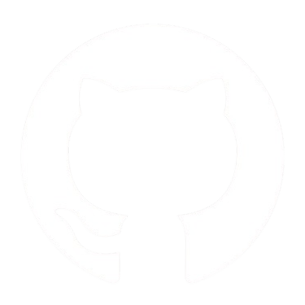

# Hi there ^_^

I'm Alexis, a software developper currently studying at Epitech Toulouse.

I enjoy learning new things, especially when its fun. ^^

Let's [connect on github](https://github.com/alexishachemi)!

## Interrests ⚡

- Game Development 🕹️

## Platforms 📱

## Tech Stack ⚙️

        

## Some Projects ⌨️

| Name                                                                              | Description                                                                                |
| --------------------------------------------------------------------------------- | ------------------------------------------------------------------------------------------ |
| [**Zappy**](https://github.com/alexishachemi/zappy)                               | Game where teams of AI players face off to be the first to evolve to the last level.       |
| [**MyVillage**](https://github.com/alexishachemi/my_village)                      | Procedural village generator with complete interior and exterior generation.               |
| [**Godot-SMC**](https://github.com/alexishachemi/godot-smc)                       | Simple finite State Machine and Component Manager for Godot 4.                             |
| [**SockNet**](https://github.com/alexishachemi/socknet)                           | TCP network interface using C sockets.                                                     |
| [**ProcGen**](https://github.com/alexishachemi/ProcGen)                           | Procedural generation library for room-based dungeons and caves.                           |
| [**Godot-OnBeatPlayer**](https://github.com/alexishachemi/godot-on-beat-player)   | Addon for the Godot engine implementing an audio stream player with tempo-based signaling. |
| [**Linked**](https://github.com/alexishachemi/linked)                             | Generic linked list library in C.                                                          |
| [**My LibC**](https://github.com/alexishachemi/my_libC)                           | General purpose library made for my C projects during my first year at Epitech.            |

## Stats 📈

  

